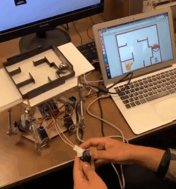

Autonomous Stewart Platform
=============================

This Arduino program was used to control a 6-servo Stewart Platform equipped with a resistive touch screen. A maze was fixed to the platform on the touchscreen, with the goal of manipulating a marble to complete the maze. The touchscreen provides real-time positional data, which is then used to calculate servo angles through inverse kinematics, in order to guide the marble. 

Autonomous operation of the platform is shown in the gif below.

  

The platform can also be controlled manually using a joystick, although it is clear that autonomous operation can solve the maze faster than manual operation.

  

